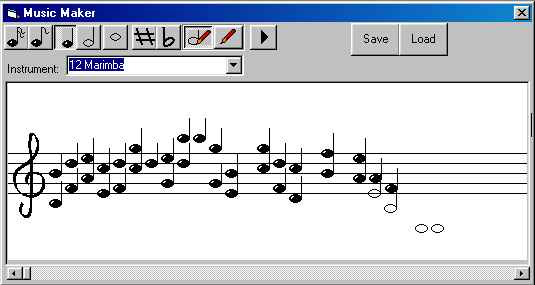



## Music Composer II \(Notation Interface\)

### Description

Compose real Music!
 
### More Info
 

             |
---                |---
**Submitted On**   |2003-03-15 17:05:26
**By**             |[Lefteris Eleftheriades](https://github.com/Planet-Source-Code/PSCIndex/blob/master/ByAuthor/lefteris-eleftheriades.md)
**Level**          |Intermediate
**User Rating**    |5.0 (60 globes from 12 users)
**Compatibility**  |VB 6\.0
**Category**       |[Sound/MP3](https://github.com/Planet-Source-Code/PSCIndex/blob/master/ByCategory/sound-mp3__1-45.md)
**World**          |[Visual Basic](https://github.com/Planet-Source-Code/PSCIndex/blob/master/ByWorld/visual-basic.md)
**Archive File**   |[Music\_Comp1565933292003\.zip](https://github.com/Planet-Source-Code/lefteris-eleftheriades-music-composer-ii-notation-interface__1-44340/archive/master.zip)

